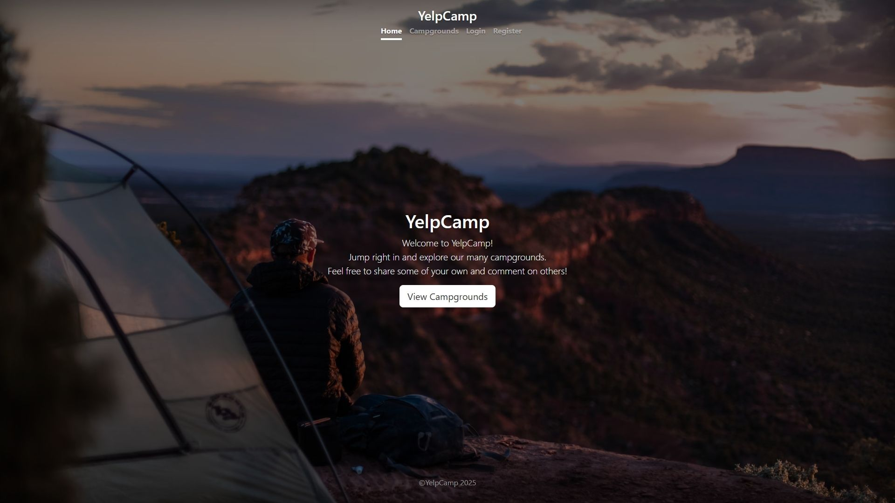
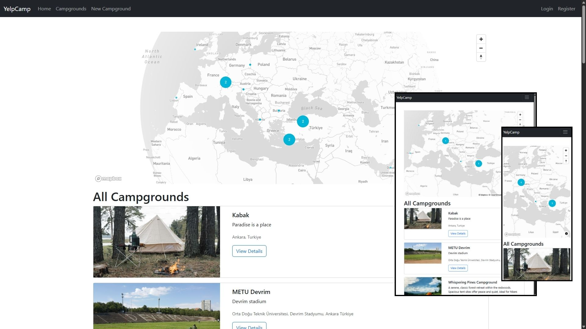
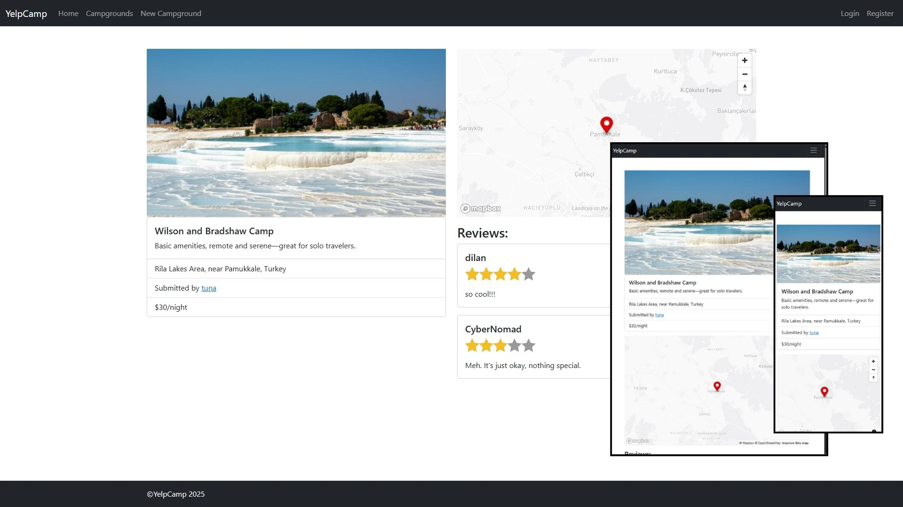
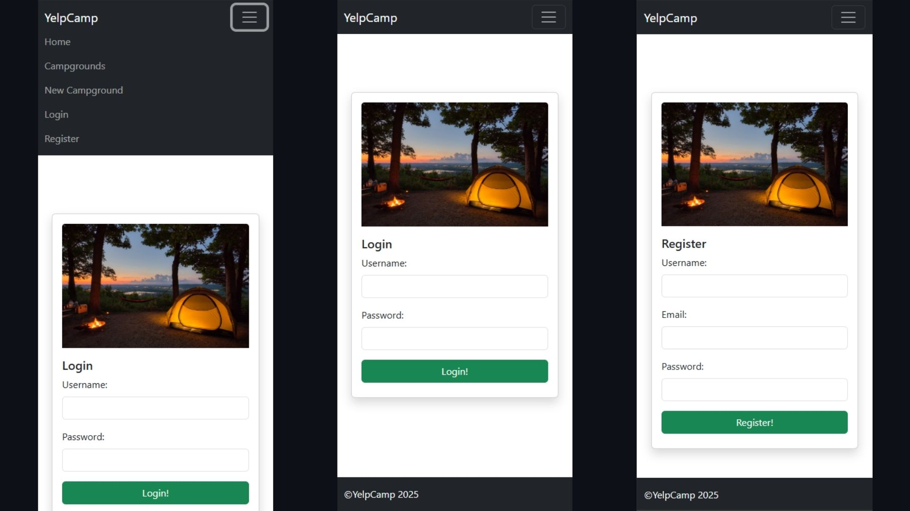
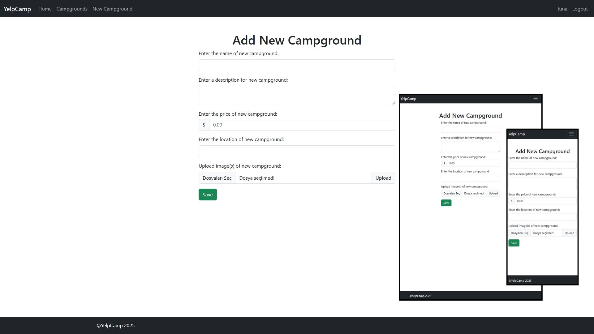
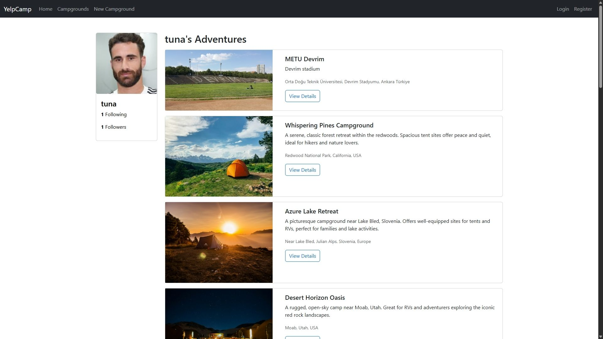
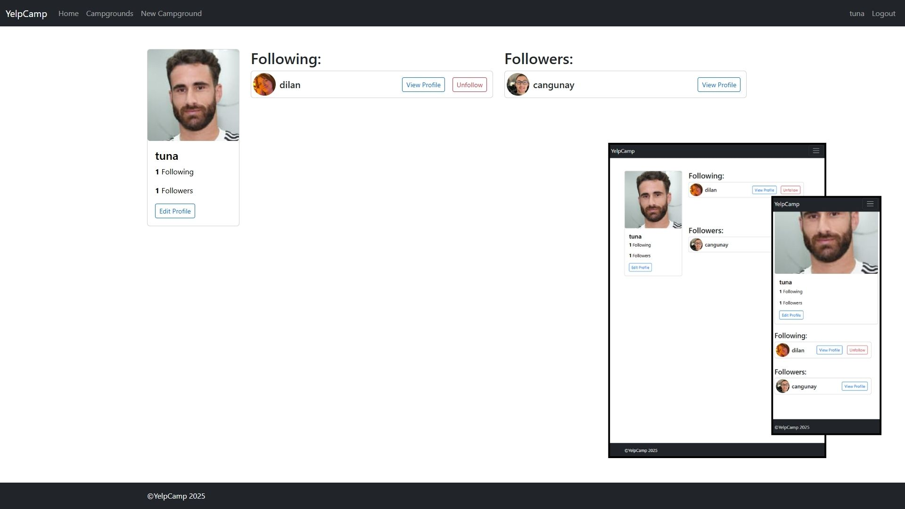

# YelpCamp

A full-stack campground review platform where users can register, post and manage campgrounds with location data, upload images, leave reviews, and follow other users.

Live Site:  
https://yelpcamp-project-nt5f.onrender.com

---

## Features

- User registration, login, and logout using Passport.js
- Campground creation with location geocoding via Mapbox
- Multiple image upload and deletion using Cloudinary
- Review system with ratings, validation, and ownership checks
- Follow and unfollow users, with follower list views
- User profiles with editable information and profile pictures
- Clustered map view showing all campground locations
- Flash messaging and form validation on both client and server sides
- Full error handling with custom middleware

---

## Tech Stack

**Backend:** Node.js, Express.js, MongoDB, Mongoose  
**Frontend:** EJS, Bootstrap, Custom CSS  
**Authentication:** Passport.js (Local Strategy)  
**File Uploads:** Multer, Cloudinary  
**Location Services:** Mapbox  
**Validation & Security:** Joi, sanitize-html, Helmet, express-mongo-sanitize

---

## Screenshots















## Installation and Setup

1.  **Clone the repository:**

    ```bash
    git clone [https://github.com/yourusername/yelpcamp-project.git](https://github.com/yourusername/yelpcamp-project.git)
    cd yelpcamp-project
    ```

2.  **Install dependencies:**

    ```bash
    npm install
    ```

3.  **Create a `.env` file in the root directory with the following variables:**

    ```
    CLOUDINARY_CLOUD_NAME=your_cloudinary_name
    CLOUDINARY_KEY=your_cloudinary_key
    CLOUDINARY_SECRET=your_cloudinary_secret
    MAPBOX_TOKEN=your_mapbox_token
    DB_URL=your_mongodb_connection_string
    SESSION_SECRET=your_session_secret
    ```

    _Replace the placeholder values with your actual credentials and connection strings._

4.  **Run the development server:**

    ```bash
    node app.js
    # or
    npm run dev
    ```

5.  Open your browser and navigate to `http://localhost:3000`.

## License

This project is licensed under the MIT License.

## Author

Built by tuna-d. Based on the original YelpCamp project by Colt Steele, extended with additional features and improvements.
